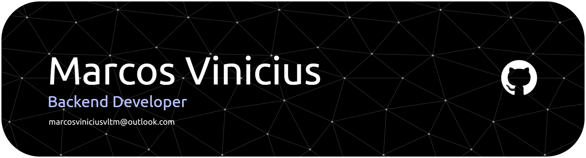

  

<h1 align="center">Marcos Vinicius</h1>

<strong>Backend Developer</strong>

  🚀 Foco em APIs REST, arquitetura backend e boas práticas de desenvolvimento.

---

## 👨‍💻 Sobre mim

Sou desenvolvedor backend com foco em **Java + Spring Boot**, com experiência em construir **APIs bem estruturadas**, com **boas práticas**, segurança e documentação clara.  

- 🔭 Atualmente trabalhando em projetos com **Spring Boot + PostgreSQL + Docker**
- 📚 Estudando: **Docker / AWS / Testes / Microsserviços /**
- 🎯 Objetivo: atuar como backend em projetos reais e ambientes de alta performance

---

## 🛠️ Tecnologias & Ferramentas

### Backend

### Banco de Dados

### DevOps / Infra

### Ferramentas

---

## 📖 Atualmente estudando

- Microservices
- Clean Architecture / SOLID
- AWS para deploy e infraestrutura

---

## 📬 Contato

- 📧 **Email:** [marcosviniciusvltm@outlook.com](mailto:marcosviniciusvltm@outlook.com)
- 💼 **LinkedIn:** [Marcos Vinicius](https://www.linkedin.com/in/marcos-vinicius-da-silva-valentim-8718aa22b/)
